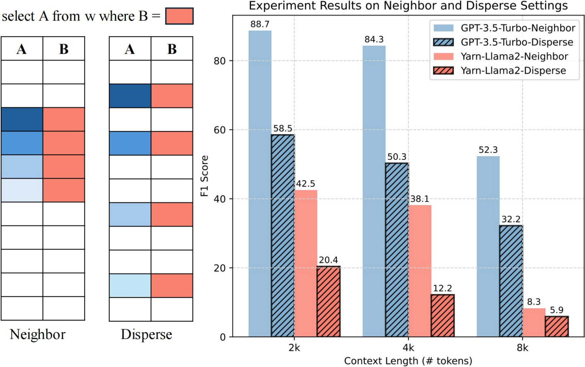
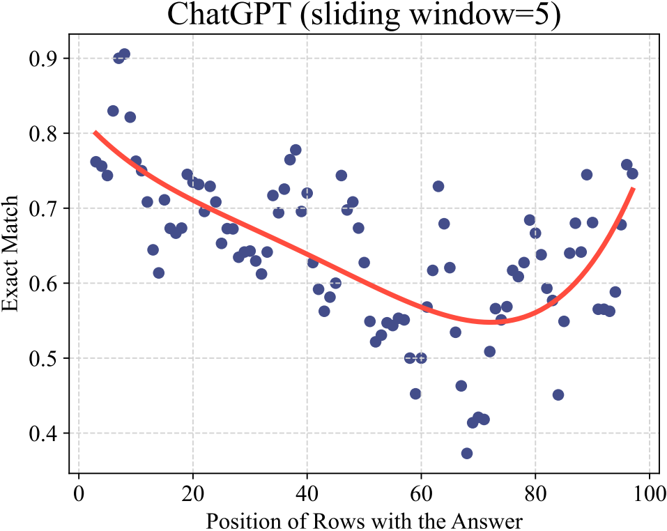
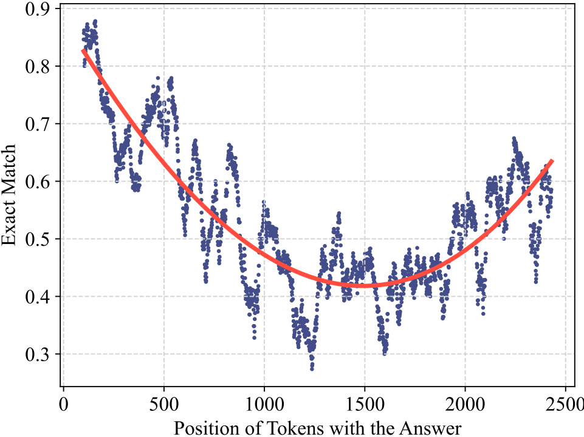
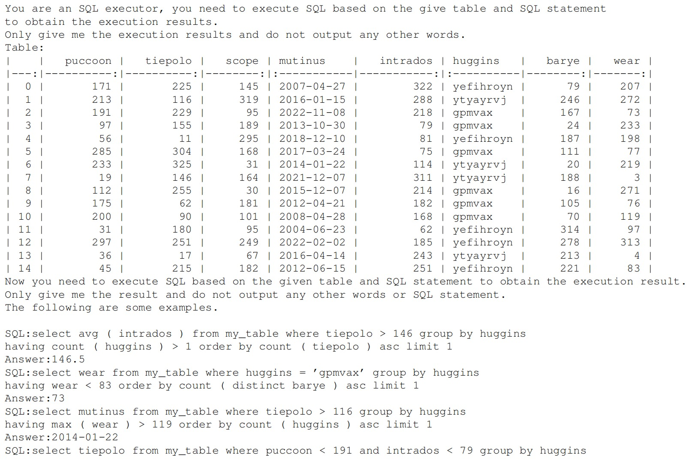
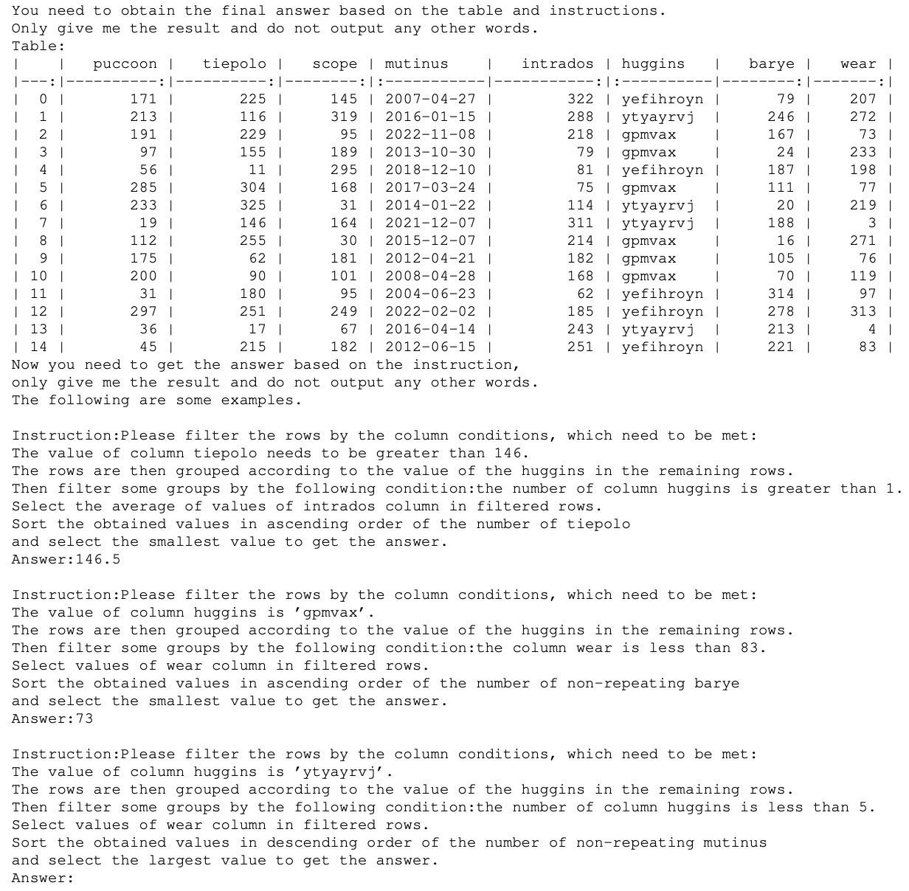
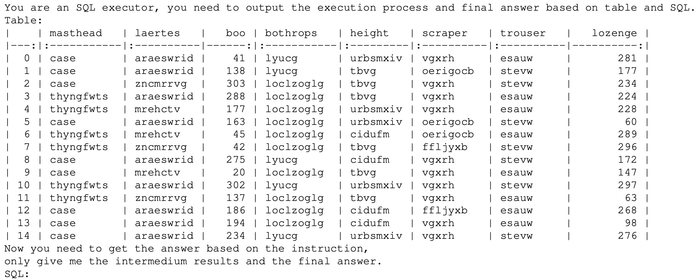
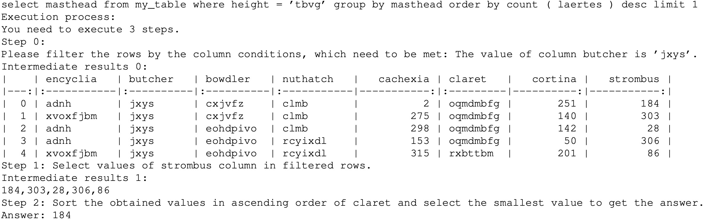

<div align="center">
  
  <br />
  <br />
</div>


# S3Eval: A Synthetic, Scalable and Systematic Evaluation Suite for Large Language Models

The official repository which contains the code and data for our paper **S3Eval**: A **S**ynthetic, **S**calable and **S**ystematic  Evaluation Suite for Large Language Models.

Work in progress......

# 🔥 Updates

- [**2023-11-08**]: We update code and support multilingual test.

- [**2023-10-24**]: We released our [code](https://github.com/lfy79001/S3Eval) and [paper](https://arxiv.org/abs/2310.15147).

# 🔧 Task
<p align="center">

</p>


# ✨ Features
S3Eval is a platform for Large Language Model Held-out Evaluation and Analysis. It has the following features:
- **Reasoning**: SQL contains a rich grammar in which each keyword implies a different reasoning capability, and S3Eval can effectively test model reasoning capabilities.
- **Long-Context Understanding**: The difficulty of long text evaluation is how to collect meaningful texts and tasks, our work can theoretically evaluate any long-context capability of any LLM context windows length. 
- **Controllable Analysis**: This platform allows fine-grained control of data generation. Such as detailed attributes of the table, fine-grained difficulty control of the generated SQL, and so on. Users have the flexibility to use it to explore more features of LLM.
- **Dynamic without data leakage**: Randomly construct synthetic data that has never been seen by LLMs, which greatly alleviates data leakage problem in LLM evaluation.
- **Customizable**: Users can use their own xlsx/csv tables to generate SQL of any complexity.


# Some Insight
## Benchmark Alignment

<div style="display: flex;">
    
    
</div>


We use exact match (EM) metric as our evaluation function. And we consider the Pearson correlation coefficient (r) and the Kendall rank correlation coefficient (τ) as our correlation functions. 

The results show strong alignment between S3Eval and BBH. For CodeLLM, it shows the alignment between S3Eval and HumanEval.

## Long-Context Analysis
<div align="center">
  
</div>

We can clearly figure out that the performance of almost all LLMs, on S3Eval, decreases significantly as context length increasing.

<div align="center">
  
</div>

It shows that existing long context extension methods, while improving performance on sliding windows, perform poorly on modelling of a truly global nature. 

## Answer position analysis

<div style="display: flex;">
    
    
</div>

## Examples Demostration

#### SQL Execution Examples (Few-Shot)

<p align="center">

</p>

#### Multi-Step Instruction Examples (Few-Shot)

<p align="center">

</p>

#### Chain-of-Thought SQL Execution Prompting examples

<p align="center">
    
    
</p>


# ⚙️ Quickstart

### Install required packages
```bash
bash requirements.sh
```

### Generate the same setting data as in the paper
```bash
python quick_start.py
```

```python
s3eval = S3Eval("general") # general,easy,long2k,long4k,long8k,long16k,long32k,long64k,long128k
output_path = "./data/general1.json"  # Custom output file name
data = s3eval.generate_data(500, output_path) # total_number, output_path
```

### Generate data with specific number of tokens

If you want to quickly generate data with specific number of tokens,

According to your needs, change __context_length__, __context_length_format__, __tokenizer__.
```bash
bash run.sh
```

```bash
# parameter introduction
python synthetic.py \
  --db_path ./db/db1 \  # Location of the generated tables
  --new_db 1 \   # True: create new tables in this db_path, then generate data. False: use existing tables to generate data
  --total_number 1000 \   # How many data do you want to generate
  --each_table_number  50 \  # How many data do you want to generate on one table
  --database_config ./config/database_config.json \ # Table Config
  --sql_config ./config/sql_config.json \ #   # SQL Config File
  --template  ./template/general.txt  \  # SQL Template
  --context_length 1000 \                # Optional! Control the context length in token level
  --context_length_format flatten \     # Optional! Control the context length in token level
  --tokenizer mistralai/Mistral-7B-v0.1 \ # Optional! Control the context length in token level, 
```

### Generate data with custom template

You can change __template__ according to your needs, for example

```bash
# parameter introduction
python synthetic.py \
  --db_path ./db/db1 \  # Location of the generated tables
  --new_db 1 \   # True: create new tables in this db_path, then generate data. False: use existing tables to generate data
  --total_number 1000 \   # How many data do you want to generate
  --each_table_number  50 \  # How many data do you want to generate on one table
  --database_config ./config/database_config.json \ # Table Config
  --sql_config ./config/sql_config.json \ #   # SQL Config File
  --template  ./template/easy.txt
```

There are two template formats: 

- Fine Template: used for fine-grained control and analysis (e.g. where_condition.txt)
- Coarse Template: used to generate diverse SQL for overall analysis  (e.g. general.txt)

You can customize the required template settings


# 🔧 Detailed Configuration Introduction


### run.sh

```bash
python synthetic.py \
  --db_path ./db/db1 \  # Location of the generated tables
  --new_db 1 \   # True: create new tables in this db_path, then generate data. False: use existing tables to generate data
  --total_number 1000 \   # How many data do you want to generate
  --each_table_number  50 \  # How many data do you want to generate on one table
  --database_config ./config/database_config.json \ # Table Config
  --sql_config ./config/sql_config.json \ #   # SQL Config File
  --template  ./template/general.json  \  # SQL Template
  --context_length 1000 \                # Optional, Control the context length in token level
  --context_length_format flatten \     # Optional, Control the context length in token level
  --tokenizer mistralai/Mistral-7B-v0.1 \ # Optional, Control the context length in token level
  --data_mode eval \ # data format styles, 'eval' is more commonly used. Changes are not recommended.
```
  
### database_config.json
```bash
{
  "col_min": 5, // the min number of cols
  "col_max": 8, // the max number of cols
  "row_min": 15,  // the min number of rows
  "row_max": 40,  // the max number of rows
  "text_int_date": [0.55, 0.35, 0.1], // text,int,date  header ratio
  "text_int_date_fix": ["TEXT", "TEXT", "INT", "INT", "INT"], // Specify the type of each header
  // Probability of duplicate values in each column
  "value_repeat_ratio": [0, 0.2, 0.3, 0, 0, 0, 0, 0, 0.2, 0.5], 
  "value_repeat_ratio_fix": ["random", "random"], // Specify the duplicate values of each column
}
```

### sql_config.json
```bash
{
  "nest": [1],  // Number of SQL nestings. options: [1], [2], [1,2],[1,2, 3]
  "keywords_setting": { // if a Keyword is False, then no SQL containing this Keyword is generated.
    "select": true,      
    "where": true,
    "group by": true,
    "having": true,
    "order by": true
  },
  "length_setting": {      // control the length of sql
    "is_available": false, // To enable this setting, you need to adjust "is_available" to true first.
    "value": [],           // 'value' can be set to specific values, such as [13,14,15], if value is null, then the range is used [min, max]
    "min": 6,
    "max": 16
  },
  "column_ratio": {        // Controlling the ratio of columns involved in SQL
    "is_available": false,  // To enable this setting, you need to adjust "is_available" to true first.
    "value": [],            // 'value' can be set to specific values, such as [1,2], Control the number of columns involved in SQL
    "min": 0.1,             // if value is null, then the range is used [min, max], it's the used ratio = (used columns) / (all columns)
    "max": 0.3
  },
  "select_row_ratio":{     // Controlling the ratio of rows involved in select keyword
    "is_available": false,  // To enable this setting, you need to adjust "is_available" to true first.
    "value": [],            // 'value' can be set to specific values, such as [1,2,3,4], Control the number of rows involved in SQL
    "min": 0.1,             // if value is null, then the range is used [min, max], it's the used ratio = (select rows) / (all rows)
    "max": 0.2
  },
  "calculate_times": {   // Controlling the calculate times of the sql ['+','-','*','/','sum','count','min','max','avg']
    "is_available": false,   // To enable this setting, you need to adjust "is_available" to true first.
    "value": [1,2,3,4]      // 'value' can be set to specific values, means the calculate times
  },
  "filter_times": {  // Controlling the filter times of the sql ['=','>','<','in','like']
    "is_available": false,   // To enable this setting, you need to adjust "is_available" to true first.
    "value": [1,2,3,4,5]  // 'value' can be set to specific values, means the calculate times
  },
  "answer_location": {    // Controlling the location of answer in the table, usually used in long-context understanding
    "is_available": false,   // To enable this setting, you need to adjust "is_available" to true first.
    "value": null,          
    "min": 0.1,             // if value is null, then the range is used [min, max], means that  0.1 <  (Row where answer is located ) / (Row number) < 0.9
    "max": 0.9              
  },
  "answer_cells_number": 1,  // usually remains 1 in this repo, we often just test the sql whose answer is from one cell.
  "include": [],
  "exclude": [],
  "output_config":{
    "process": false,   // Whether to output SQL generation process
    "multistep": true,   // Whether to output multi-step instruction
    "cot": false        // Whether to output chain-of-thought data
  }
}
```


### Your own tables

If you want to general SQLs with your own xlsx/csv tables, Use the following steps:
```bash
# convert xlsx/csv tables to sqlite3
python convert_csv.py --db_path <new_db_files_path> --csv_path <your_tables_folder_path> 
# generate data
python systhetic.py --new_db 0 --db_path <new_db_files_path>
# Other setting is the same as normal
```


## Examples
for example, if you want to generate `where` SQL with easy level, you have two options

__Method1:Change `sql_config` to this__
```bash
{
  "nest": [1],
  "keywords_setting": { 
    "select": true,      
    "where": true,
    "group by": false,
    "having": false,
    "order by": false
  },
  "length_setting": {
    "is_available": false,
    "value": [],
    "min": 6,
    "max": 16
  },
  "column_ratio": {
    "is_available": false,
    "value": [],
    "min": 0.1,
    "max": 0.3
  },
  "select_row_ratio":{
    "is_available": false,
    "value": [],
    "min": 0.1,
    "max": 0.2
  },
  "calculate_times": {
    "is_available": true,
    "value": [0]
  },
  "filter_times": {
    "is_available": false,
    "value": [1,2,3,4,5]
  },
  "answer_location": {
    "is_available": false,
    "value": null,
    "min": 0.1,
    "max": 0.9
  },
  "answer_cells_number": 1,
  "include": [],
  "exclude": []

}
```
__Method2: Direct use template file `template/easy.txt`__

This approach has low SQL diversity


# Leardboard

<p align="center">

</p>


# Bibtex

```bash
@misc{lei2023s3eval,
      title={S3Eval: A Synthetic, Scalable, Systematic Evaluation Suite for Large Language Models}, 
      author={Fangyu Lei and Qian Liu and Yiming Huang and Shizhu He and Jun Zhao and Kang Liu},
      year={2023},
      eprint={2310.15147},
      archivePrefix={arXiv},
      primaryClass={cs.CL}
}
```


