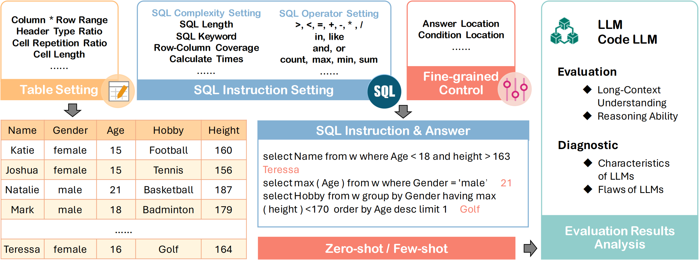
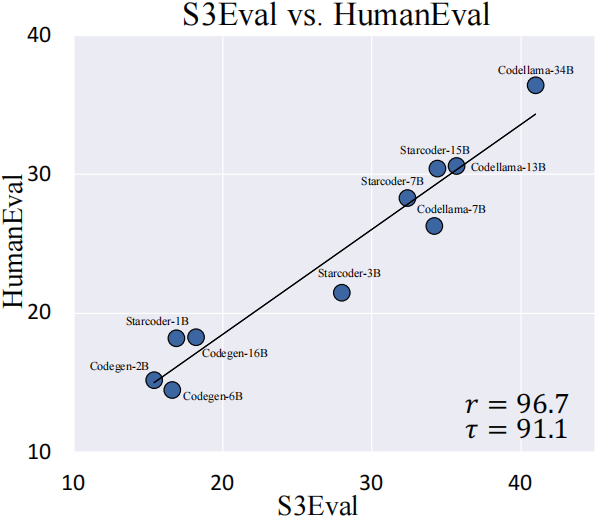
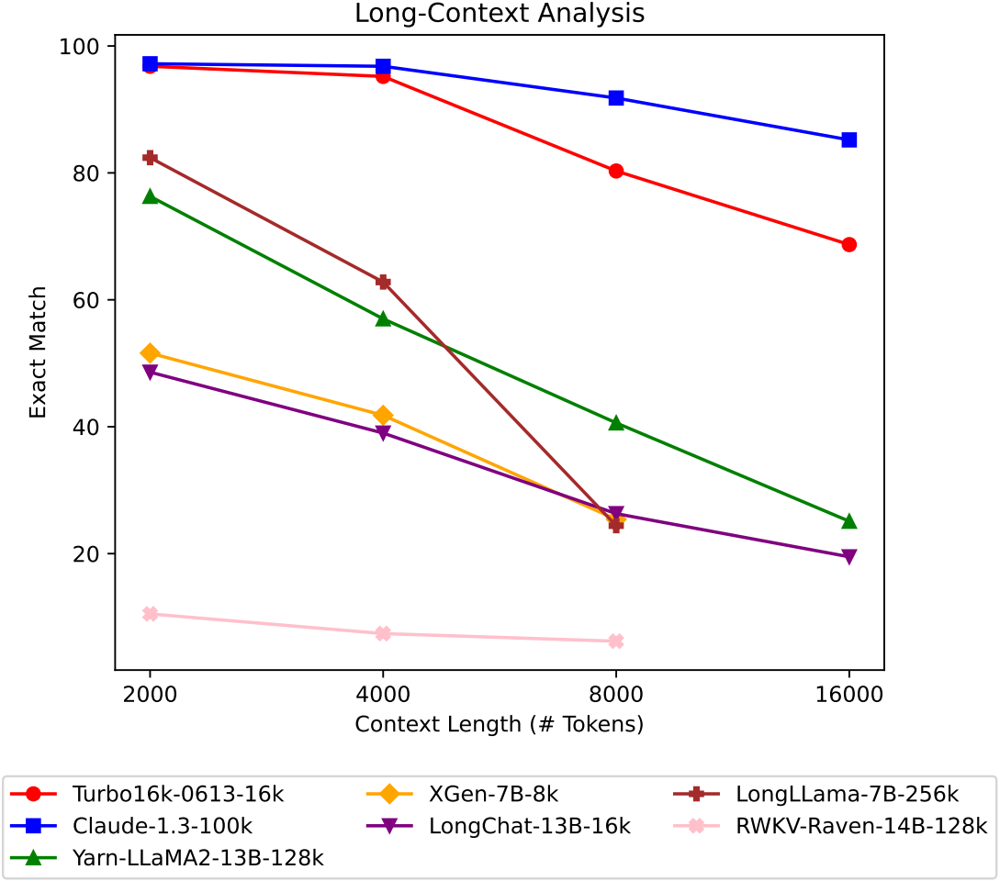
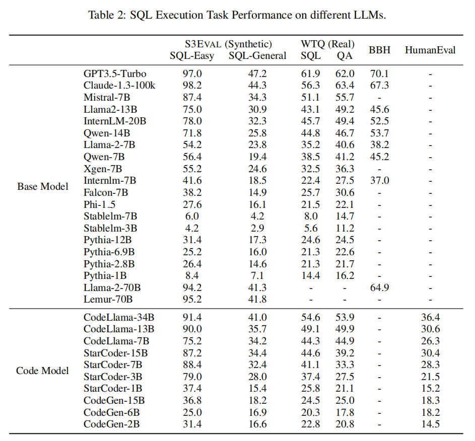

<div align="center">
  
  <br />
  <br />
</div>


# S3Eval: A Synthetic, Scalable and Systematic Suite for Evaluating Language Models

The official repository which contains the code and data for our paper **S3Eval**: A **S**ynthetic, **S**calable and **S**ystematic Suite for Evaluating Language Models.

# 🔥 Updates

- [**2023-10-10**]: We released our [code](https://github.com/lfy79001/SQLEval)

# 🔧 Task
<p align="center">

</p>


# ✨ Features
SQLEval is a platform for Large Language Model Held-out Evaluation and Analysis. It has the following features:
- **Reasoning**: SQL contains a rich grammar in which each keyword implies a different reasoning capability, and SQLEval can effectively test model reasoning capabilities.
- **Long-Context Understanding**: The difficulty of long text evaluation is how to collect meaningful texts and tasks, our work can theoretically evaluate any long-context capability of any LLM context windows length. 
- **Controllable Analysis**: This platform allows fine-grained control of data generation. Such as detailed attributes of the table, fine-grained difficulty control of the generated SQL, and so on. Users have the flexibility to use it to explore more features of LLM.
- **Dynamic without data leakage**: Randomly construct synthetic data that has never been seen by LLMs, which greatly alleviates data leakage problem in LLM evaluation.


# Some Insight
## Benchmark Alignment

<div style="display: flex;">
  
  
</div>

We use exact match (EM) metric as our evaluation function. And we consider the Pearson correlation coefficient (r) and the Kendall rank correlation coefficient (τ) as our correlation functions. 

The results show strong alignment between S3Eval and BBH. For CodeLLM, it shows the alignment between S3Eval and HumanEval.

## Long-Context Analysis
<div align="center">
  
</div>

We can clearly figure out that the performance of almost all LLMs, on S3Eval, decreases significantly as context length increasing.


# ⚙️ Start

To quickly start, you just run this scripts to generate tables and sqls.
```bash
bash run.sh
```

If you want to visualize the generated data, you can use this code to convert json to txt
```bash
python data/json_to_text.py <generated_data_path>
```


```bash
# parameter introduction
python synthetic.py \
  --db_path ./db/db1 \  # Location of the generated tables
  --new_db True \   # True: create new tables in this db_path, then generate data. False: use existing tables to generate data
  --total_number 1000 \   # How many training data do you want to generate
  --each_table_number  50 \  # How much training data do you want to generate on one table
  --database_config ./config/database_config.json \ # Fine-grained config for table properties
  --sql_config ./config/sql_config.json \ #   # The most important file, SQL Config File
  --synthetic_mode general \ # general: Standard diverse SQL generation methods(recommended). template: Custom SQL template generation.
  --template  ./template/general.json  \  # SQL grammar/template location
  --data_mode eval \ # data format styles, 'eval' is more commonly used. Changes are not recommended.
```

If you want to change the database config     
```bash
// database_config.json
{
  "col_min": 5, // the min number of cols
  "col_max": 8, // the max number of cols
  "row_min": 15,  // the min number of rows
  "row_max": 40,  // the max number of rows
  "text_int_date": [0.55, 0.35, 0.1]  // text,int,date  header ratio
}
```

If you want to change the sql config
```bash
{
  "nest": [1],  // Number of SQL nestings. options: [1], [2], [1,2],[1,2, 3]
  "keywords_setting": { // if a Keyword is False, then no SQL containing this Keyword is generated.
    "select": true,      
    "where": true,
    "group by": true,
    "having": true,
    "order by": true
  },
  "length_setting": {      // control the length of sql
    "is_available": false, // To enable this setting, you need to adjust "is_available" to true first.
    "value": [],           // 'value' can be set to specific values, such as [13,14,15], if value is null, then the range is used [min, max]
    "min": 6,
    "max": 16
  },
  "column_ratio": {        // Controlling the ratio of columns involved in SQL
    "is_available": false,  // To enable this setting, you need to adjust "is_available" to true first.
    "value": [],            // 'value' can be set to specific values, such as [1,2], Control the number of columns involved in SQL
    "min": 0.1,             // if value is null, then the range is used [min, max], it's the used ratio = (used columns) / (all columns)
    "max": 0.3
  },
  "select_row_ratio":{     // Controlling the ratio of rows involved in select keyword
    "is_available": false,  // To enable this setting, you need to adjust "is_available" to true first.
    "value": [],            // 'value' can be set to specific values, such as [1,2,3,4], Control the number of rows involved in SQL
    "min": 0.1,             // if value is null, then the range is used [min, max], it's the used ratio = (select rows) / (all rows)
    "max": 0.2
  },
  "calculate_times": {   // Controlling the calculate times of the sql ['+','-','*','/','sum','count','min','max','avg']
    "is_available": false,   // To enable this setting, you need to adjust "is_available" to true first.
    "value": [1,2,3,4]      // 'value' can be set to specific values, means the calculate times
  },
  "filter_times": {  // Controlling the filter times of the sql ['=','>','<','in','like']
    "is_available": false,   // To enable this setting, you need to adjust "is_available" to true first.
    "value": [1,2,3,4,5]  // 'value' can be set to specific values, means the calculate times
  },
  "answer_location": {    // Controlling the location of answer in the table, usually used in long-context understanding
    "is_available": false,   // To enable this setting, you need to adjust "is_available" to true first.
    "value": null,          
    "min": 0.1,             // if value is null, then the range is used [min, max], means that  0.1 <  (Row where answer is located ) / (Row number) < 0.9
    "max": 0.9              
  },
  "answer_cells_number": 1,  // usually remains 1 in this repo, we often just test the sql whose answer is from one cell.
  "include": [],
  "exclude": []
}
```

Template or General

`general` mode is recommended to use, cause it has more grammar. You only need to control the config, or simply control the file.

`template` mode can also be used, but this template is slightly more difficult to write. can be used when testing long-context, see template template/long.txt


## Examples
for example, if you want to generate `where` SQL with easy level, you have two options

__Method1:Change `sql_config` to this__
```bash
{
  "nest": [1],
  "keywords_setting": { 
    "select": true,      
    "where": true,
    "group by": false,
    "having": false,
    "order by": false
  },
  "length_setting": {
    "is_available": false,
    "value": [],
    "min": 6,
    "max": 16
  },
  "column_ratio": {
    "is_available": false,
    "value": [],
    "min": 0.1,
    "max": 0.3
  },
  "select_row_ratio":{
    "is_available": false,
    "value": [],
    "min": 0.1,
    "max": 0.2
  },
  "calculate_times": {
    "is_available": true,
    "value": [0]
  },
  "filter_times": {
    "is_available": false,
    "value": [1,2,3,4,5]
  },
  "answer_location": {
    "is_available": false,
    "value": null,
    "min": 0.1,
    "max": 0.9
  },
  "answer_cells_number": 1,
  "include": [],
  "exclude": []

}
```
__Method2: Direct use template file `template/easy.txt`__

This approach has low SQL diversity

You have to change the `synthetic_mode` for `general` to `template`


# Leadboard

<p align="center">

</p>


